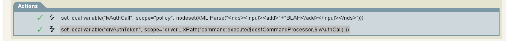
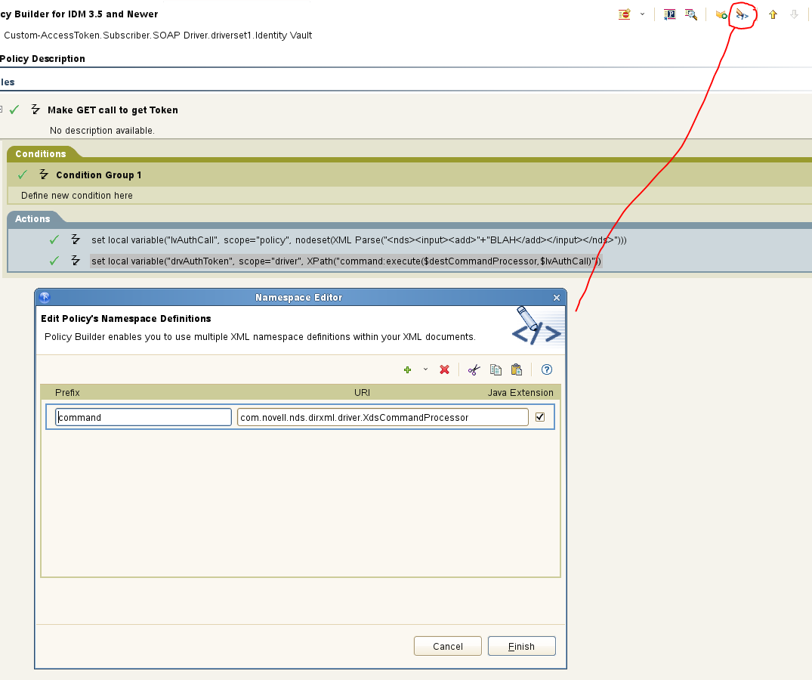

#Set Command Destination Processor

Two Actions to be created:

1) Using a local variable create an XML doc as a new event for Command Processor to process.
```
<do-set-local-variable name="lvAuthCall" scope="policy">
	<arg-node-set>
		<token-xml-parse>
			<token-text xml:space="preserve">&lt;nds>&lt;input>&lt;add></token-text>
			<token-text xml:space="preserve">BLAH&lt;/add>&lt;/input>&lt;/nds></token-text>
		</token-xml-parse>
	</arg-node-set>
</do-set-local-variable>
```

2) Use a driver variable to execute Command Processor.
```
<do-set-local-variable name="drvAuthToken" scope="driver">
	<arg-string>
		<token-xpath expression="command:execute($destCommandProcessor,$lvAuthCall)"/>
	</arg-string>
</do-set-local-variable>
```

Actions should look like the following:


3) Namespace needs to be setup with the following:
```command``` AND ```com.novell.nds.dirxml.driver.XdsCommandProcessor```

Namespace should look like the following:

